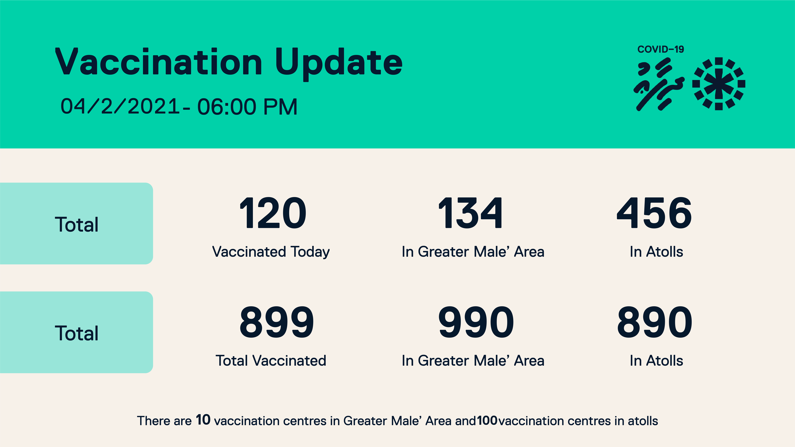
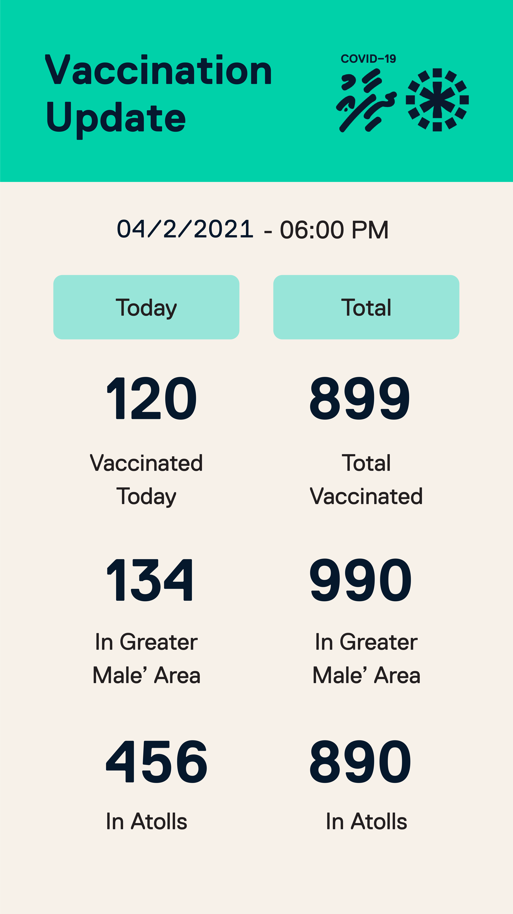

# HEOC Tools 
Quick image generation tools written to aid in operations at HEOC 
Usage examples can be found in usage.py
images are generated using data in templates.json


# Generated Image example
### vaccine sm


### vaccine instagram story



# To generate Vaccine data images 


```
from HeocTools import genVaccineImages


#example of input data
vaccine_sm_data = {
    "date":"04/2/2021",
    "today":"120",
    "male_area":"134",
    "atoll":"456",
    "total":"899",
    "total_male":"990",
    "total_atolls":"890",
    "vacc_cen_male":"10",
    "vacc_cen_atoll":"100"
}


vacc_im = genVaccineImages(vaccine_sm_data)
```

```vacc_im``` is a tuple with two images vaccine_sm and ig_story as PIL image


please note that , tools to fetch from API and automatically post relevent channels will be 
developed once the API end points are available


### TODO 
* generate images for covid cases
* automatically generate when data from api changes and post 
